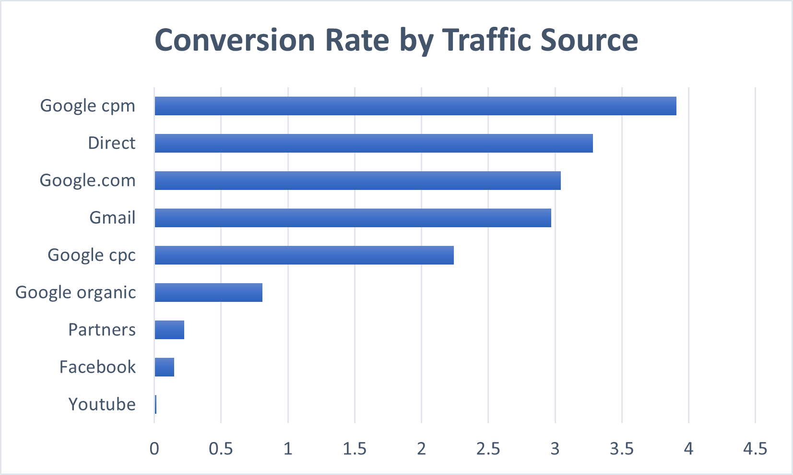
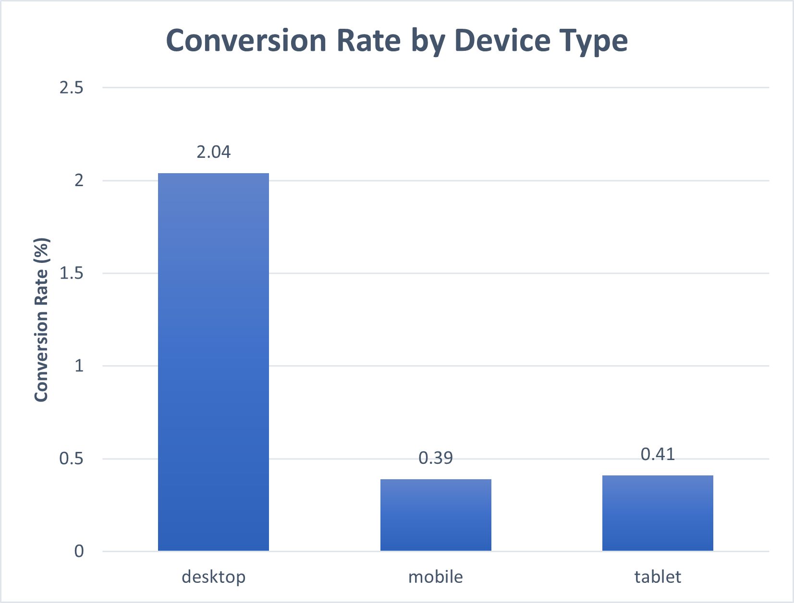
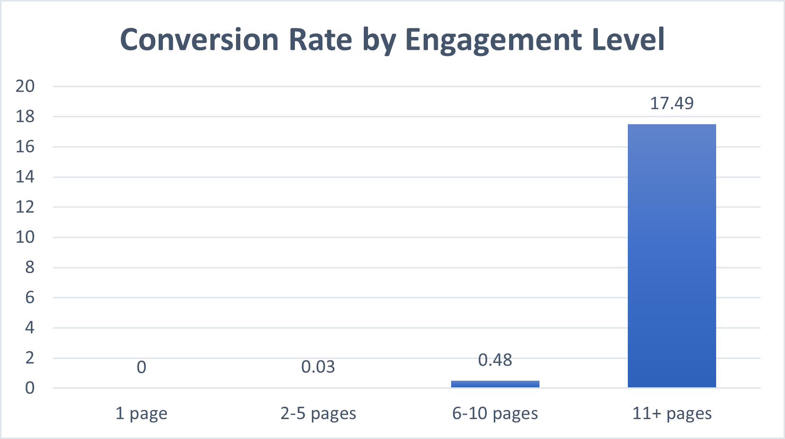
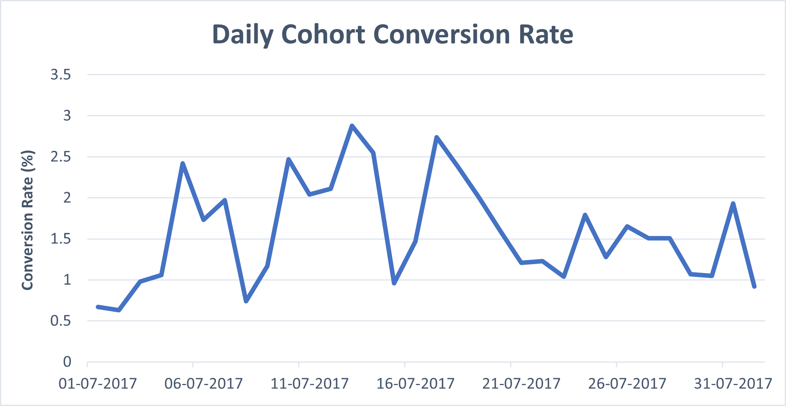

# E-commerce Funnel & Conversion Analysis

## Project Overview

This project analyzes user conversion behavior using the Google Analytics sample e-commerce dataset available in BigQuery.

The objective of the analysis is to identify the behavioral, acquisition, and engagement factors associated with purchase conversion. The project focuses on understanding how users move through the purchase journey and which user segments demonstrate the strongest commercial intent.

The analysis was conducted using SQL in BigQuery and structured as a business-oriented funnel and behavioral analytics investigation.

---

# Business Questions

The project was designed around the following business questions:

- What percentage of sessions result in a purchase?
- Which traffic acquisition channels generate the highest conversion rates?
- How does device type affect purchasing behavior?
- How many users become customers?
- Does deeper engagement correlate with higher conversion?
- How long does it typically take users to convert?
- Do conversion patterns vary across acquisition cohorts?

---

# Dataset

Dataset used:

- Google Analytics Sample Dataset
- Source: Google BigQuery Public Datasets
- Table:
  ```sql
  bigquery-public-data.google_analytics_sample.ga_sessions_*
  ```

Analysis period:
- July 1, 2017 – July 31, 2017

The dataset contains anonymized Google Analytics 360 session-level e-commerce data from the Google Merchandise Store.

---

# Tools & Technologies

- SQL
- Google BigQuery
- VS Code
- Git & GitHub

---

# Analysis Summary

## 1. Conversion Funnel

- Total sessions analyzed: 71,812
- Purchasing sessions: 1,031
- Session conversion rate: 1.44%

The overall conversion rate reflects typical e-commerce browsing behavior, where the majority of sessions do not result in immediate purchases.

---

## 2. Traffic Source Performance

Key findings:

- Direct traffic achieved one of the strongest conversion rates among high-volume channels.
- Paid Google search traffic materially outperformed organic Google traffic.
- Organic Google traffic generated the largest traffic volume but lower conversion efficiency.
- YouTube referral traffic generated high traffic volume but almost no purchases.

These findings suggest that acquisition quality and purchase intent vary substantially across channels.



---

## 3. Device Behavior

Desktop users converted significantly better than mobile users.

Mobile devices generated a substantial share of sessions but disproportionately few purchases, suggesting potential friction in the mobile purchase journey.



---

## 4. User-Level Behavior

- Total unique users: 58,569
- Purchasing users: 964
- User conversion rate: 1.65%
- Average sessions per user: 1.23

The relatively small gap between session-level and user-level conversion rates suggests that purchasing users often convert without requiring many repeated sessions.

---

## 5. Engagement & Conversion

Conversion rates increased dramatically with user engagement depth.

Higher engagement was strongly associated with conversion likelihood, although engagement itself should not necessarily be interpreted as causal.



---

## 6. Time to Conversion

Purchasing users took an average of:

- 44.79 hours
- (~2 days)

between first recorded visit and first purchase.

This suggests that users often require consideration time before completing a transaction.

---

## 7. Cohort Analysis

Conversion performance varied substantially across acquisition cohorts.

Daily cohort conversion rates ranged from below 1% to nearly 3%, indicating meaningful differences in acquisition quality and user intent over time.



---

# Business Recommendations

Based on the analysis, several opportunities were identified to improve conversion performance and user experience.

## 1. Improve Mobile Conversion Experience
Mobile users converted at significantly lower rates than desktop users despite generating substantial traffic volume. Optimizing mobile checkout flows, navigation, and page speed may reduce friction and improve conversion efficiency.

## 2. Prioritize High-Intent Acquisition Channels
Direct and paid search traffic demonstrated substantially stronger conversion performance than awareness-oriented channels such as YouTube referrals. Marketing investment should focus on channels that consistently attract high-intent users.

## 3. Encourage Deeper User Engagement
Conversion rates increased dramatically as user engagement depth increased. Improving product discovery, related-product recommendations, and internal navigation may encourage deeper browsing behavior associated with higher purchase likelihood.

## 4. Strengthen Re-engagement Strategies
Purchasing users required an average of approximately 48 hours between first visit and first purchase. Remarketing campaigns, cart abandonment reminders, and follow-up communication may help convert delayed purchasers.

## 5. Optimize the Early-Session Experience
Users demonstrated limited repeat visitation behavior, suggesting that early interactions are especially important. Improving landing page clarity, onboarding, and initial product discovery may increase first-session conversion opportunities.

## 6. Monitor Cohort Performance Over Time
Conversion rates varied substantially across acquisition cohorts, indicating differences in traffic quality and user intent over time. Continuous cohort monitoring can help identify high-performing campaigns and acquisition periods.

---

## Power BI Dashboard

This analysis was extended into an interactive dashboard built in Power BI.

Key features:
- Conversion KPI overview
- Traffic source performance
- Device-level analysis
- Engagement-driven conversion insights
- Cohort conversion trends

Download:
- [Power BI File](dashboard/ecommerce_dashboard.pbix)
- [Dashboard PDF](dashboard/dashboard.pdf)


# Key Skills Demonstrated

This project demonstrates:

- SQL querying and data transformation
- BigQuery analytics workflows
- Funnel analysis
- Behavioral segmentation
- Cohort analysis
- KPI analysis
- Business interpretation of data
- Analytical storytelling

---

# Author

Divyansh Sikhar